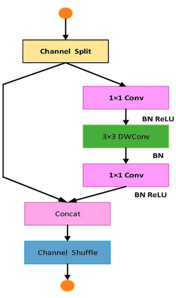
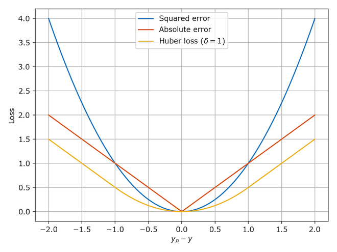

# Jakub Górniak Team

## Agata Bielska, Jakub Radziejewski, Jakub Jęsiek, Kacper Kuźnik, Aleksander Hański

**During classes we created many models, spanning ResNet, PilotNet, ShuffleNetV2, and MobileNet architectures.**


## Final Model — ShuffleNetV2 ×0.5

Our best-performing architecture is a fine-tuned **ShuffleNetV2 ×0.5** pretrained on ImageNet, implemented in `src/jetbot_models.py` as `ShuffleNetDriver`.

### Architecture
ImageNet is widely known dataset for classification problems. However, reaching the goal of the problem requires regression, so this is why we have changed the head to achieve the goal.

```
Input: 96×96 RGB image
  │
  ▼
ShuffleNetV2 ×0.5 backbone (pretrained, ImageNet)
  │  Stage 1:  3×3 conv, stride 2  → 24 channels
  │  Stage 2:  4× ShuffleNet units → 48 channels
  │  Stage 3:  8× ShuffleNet units → 96 channels
  │  Stage 4:  4× ShuffleNet units → 192 channels
  │  Conv5:    1×1 conv            → 1024 channels
  │
  ▼
START OF OUR CHANGES
AdaptiveAvgPool2d(1)   # global average pooling → (1024,)
  │
  ▼
Flatten
Dropout(p=0.3)
Linear(1024 → 64)
ReLU
Linear(64 → 2)
Tanh                   # outputs in [-1, 1]
  │
  ▼
Output: [forward, left]
```

### Quick explanation of ShuffleNet units

<div align="center">
  
</div>

What: It is an ultra-lightweight convolutional block that utilizes a channel split to divide input features into two parallel paths before merging them. For our JetBot, this serves as the foundational backbone that processes live camera frames to predict driving commands.

Why: We use it because standard architectures suffer from high inference latency on edge hardware due to heavy memory operations. ShuffleNet v2 minimizes this overhead, ensuring our robot achieves real-time, low-latency inference for immediate steering corrections.

How: At each ShuffleNet block, half of the channels bypass computation as a structural shortcut, while the other half undergoes efficient depthwise separable convolutions. The paths are then concatenated and mixed via a channel shuffle, keeping computational costs exceptionally low while maximizing cross-channel information flow.

Used architecture allowed us to have a solid baseline, over which we later experimented to improve it even more (by, for instance, frame delaying with mean or annotation of data)

### Key properties

| Property | Value |
|---|---|
| Backbone | ShuffleNetV2 ×0.5 (ImageNet pretrained) |
| Input size | 96×96 |
| Trainable parameters | ~350k |
| Output | `(forward, left)` via Tanh, range [−1, 1] |
| Optimizer | AdamW, lr=5×10⁻⁴, weight decay=1×10⁻⁴ |
| LR schedule | Cosine annealing, η_min=1×10⁻⁵ |
| Loss | Huber (δ=0.5) |
| Epochs | 50 |
| Dropout | 0.3 (head only) |
| Export | ONNX opset 11 |

### Why huber loss and not textbook MSE/MAE?

<div align="center">
  
</div>

Huber loss is a hybrid function. It takes a param delta and in set and for values -delta, delta applies MSE, otherwise MAE. 
Such combination allows to have smooth function, which later results in smoother robot behaviour while perserving meaningfullness of the cost yield by different estimations and outlier robustness.


### Training data

The model was first trained on the default course dataset (`put_jetbot_dataset/`). We then re-trained it on our own annotated data - `dataset_annotated_initial` (annotated the previous week) and `dataset_annotated_final` (annotated for the final class session). Models from both annotation rounds are kept in `models/` for comparison.

### Anti-bias: horizontal flip

The recorded driving data has an inherent left-turn bias due to the track layout. To counteract this, half of the training samples are horizontally flipped, with the `left` label sign negated accordingly. This artificially balances the left/right turn distribution without requiring additional data collection.

### Issues and how we faced them

#### Robot turning too fast

When we initially tested our baseline working solution, quickly we had noticed that our jetbot begins the turning process even before it enter it.
Our initial idea: Make the turning happen later and only when it definitely should be applied.
To achieve so, we decided to delay the robot making turn by a parametrized number of frames. Furthermore, average outcomes of parametrized number of function, to make the robot turn only if it is confident of doing so.
Nevertheless, we still wanted to make our model better.

#### Robot zig-zagging

When being on straight path, our model performed little turns. The cause of such behaviour is, by our thoughts, the delay caused by joystick when annotating data. This is why our hero, name of other groups in the lab, fought hard to re-annotate the data by hand. Initial experiment performed last week and experiment performed during last minutes of the last class showed that the model indeed stopped zig-zagging, although annotations and resulting model are still not perfect.

### Deployment

The exported ONNX model is run on the JetBot using driving script in `src/`.

We had a minimal baseline driver, but we did improve it.

**`bot_driving.py`** - our final best deployment script, configured via `config.yml`. Adds three mechanisms on top of the basic loop:
- **Fixed-delay buffer** (`latency_frames`): instead of acting on the newest prediction, the robot acts on a prediction made `N` frames ago. This compensates for camera and inference latency so that steering commands arrive at the right moment.
- **Prediction averaging** (`avg_frames`): the applied command is the mean of the last `K` buffered predictions, smoothing out per-frame noise (although it does not really work well).
- **Minimum forward speed** (`minimum_forward_value`): prevents the robot from stalling when the predicted forward value dips near zero.

All three additional parameters are tunable in `config.yml` without modifying the script.

Basic driving script as well as our attempts to implement more sophisticated mechanisms in driving scripts can be found in `experiments/bot_driving_scripts`.

---

## Other Approaches

### 1. Transfer Learning - ResNet18 Pretrained

**Path**: `experiments/train_pretrained_cnn.py`

Standard ImageNet pretrained ResNet18 with a custom regression head (Linear → Tanh → 2 outputs).

| Setting | Value |
|---|---|
| LR | 1e-4 (Adam) |
| Augmentation | RandomCrop, ColorJitter, GaussianBlur, RandomErasing |
| Anti-bias | WeightedRandomSampler weighted by label magnitude |
| Loss | Val2WeightedMSELoss (steering gradient up-weighted) |

---

### 2. Classification introduced

Having the data explored, we noticed that only minority of the turn data is not in set {-1, 0, 1}. This is why we decided to experiment with possible architectures even more, introducing two solutions based on that (and pretrained ResNet).

#### 2.1 Dual-Head ResNet18 - Classification + Regression

First architecture involved classification on turning parameter and regression on front.

**Path**: `experiments/dualhead.py`

ResNet18 backbone with two separate heads:
- **Head 1**: regression for `forward` (Linear → Tanh)
- **Head 2**: 3-class classifier for `left` direction ({left, straight, right})

| Setting | Value |
|---|---|
| LR | 1e-4 (AdamW), ReduceLROnPlateau |
| Dropout | 0.5 |
| Weight decay | 1e-2 |
| Augmentation | RandomRotation(15°), RandomPerspective, ColorJitter, GaussianBlur, RandomErasing |
| Anti-bias | Inverse-frequency class weighting for turn classifier |
| Loss | MSE(forward) + CrossEntropy(left direction) |

---

#### 2.2 Dual Classifier - ResNet18, Speed + Turn Both as Classes

Second classification model involded double classifier - both for turning and moving front. To make the data able to classify, data was binned.

**Path**: `experiments/dualclassifer.py`

Both outputs treated as classification problems:
- **Speed head**: 3 classes — slow (0.0), medium (0.5), fast (1.0)
- **Turn head**: 3 classes — left (−1), straight (0), right (+1)
- Shared Linear(512→256) + BatchNorm + ReLU + Dropout(0.3) layer

| Setting | Value |
|---|---|
| LR | 1e-3 (AdamW), ReduceLROnPlateau |
| Dropout | 0.3 |
| Augmentation | RandomRotation(5°), RandomPerspective, ColorJitter, GaussianBlur, RandomErasing, optional CLAHE |
| Anti-bias | Inverse-frequency class weighting for both heads |
| Loss | CrossEntropy × 2 |

#### Problems with above two solutions

Even though the idea was to simplify the problem, it did not perform good, as it was clear to us that the intermediate values that would be returned for regression, were significant in terms of model performance, even if they were not present in training data. Lack of those values led to jetbot not being able to go back on track, when it turned a little when going front. 

---

### 3. Custom PilotNet

**Path**: `experiments/custom_pilotnet_hsv_augmentation/`

Custom PilotNet-inspired architecture:
- 5 conv layers (32→32→64→128→128) with BatchNorm
- Fully connected regression head

| Setting | Value |
|---|---|
| Optimizer | Adam |
| Augmentation | HSV-space color, Gaussian noise, shadow cutout, horizontal flip (negate steering) |
| Anti-bias | Horizontal flip oversampling |


---

### 4. PilotNet - Original NVIDIA Architecture

**Path**: `experiments/pilotnet/`

Faithful NVIDIA PilotNet implementation:
- 5 conv layers (24→36→48→64→64), ELU activations
- 4 FC layers (100→50→10→2), Tanh output

| Setting | Value |
|---|---|
| LR | 1e-3 (AdamW) + 3-epoch linear warmup + cosine decay |
| Anti-bias | WeightedRandomSampler on 10 steering bins |
| Loss | steer_MSE × 1.0 + throttle_MSE × 0.3 |

---

### 5. 6 Variants of PilotNet-style backbone

**Path**: `experiments/pilotnet_shufflenet_variants/`

All variants share: PilotNet-style backbone, AdamW, cosine LR, ONNX opset 11 export, runtime EMA smoothing (α=0.3).

| Model | Architecture | Input | Params | Key Difference | Val Loss |
|---|---|---|---|---|---|
| `pilotnet_anti` | PilotNet 224 | 224×224 | ~195k | label_shift=2 (200ms lookahead) | 0.213 |
| `pilotnet_fl_shift1` | PilotNet 224 | 224×224 | ~195k | label_shift=1 (100ms lookahead) | 0.216 |
| `mobilenetv3_fl_pretrained` | MobileNetV3-Small (pretrained) | 224×224 | 1.08M | ImageNet backbone, lr=5e-4 | **0.170** |
| `shufflenet_anti_96` | ShuffleNetV2 x0.5 (pretrained) | 96×96 | ~407k | Smallest input, fastest inference | 0.235 |
| `shufflenet_anti_224` | ShuffleNetV2 x0.5 (pretrained) | 224×224 | ~407k | Same as above, larger input | 0.249 |
| `dualhead_class_reg` | PilotNet + dual head | 224×224 | ~240k | Left classified (7 bins) + forward regressed | 0.211 |

All use WeightedRandomSampler on 7 `|left|` bins (except `dualhead_class_reg` which uses CrossEntropy + smooth L1).

---

### 6. Other models

**Path**: `experiments/pilotnet_variants_bundle/`

| Model | Key Idea | Anti-bias Strategy |
|---|---|---|
| `pilotnet_fl_wsampler` | Baseline PilotNet 224 | WeightedRandomSampler, 7 bins |
| `pilotnet_fl_wloss` | Same arch, weighted loss instead of sampler | Per-dim Huber loss [forward×1.0, left×3.0] |
| `pilotnet_fl_shift1` | Temporal lookahead to fix late reactions | WS 7 bins + label_shift=1 |
| `pilotnet_motor_wsampler` | Predict (motor_L, motor_R) directly | WS on motor differential |
| `dualhead_class_reg` | Classify left direction, regress forward | CrossEntropy(7-bin left) + smooth L1 |
| `mobilenetv3_fl_pretrained` | Pretrained backbone for richer features | WS 7 bins, ImageNet norm |

All: lr=1e-3, AdamW, cosine schedule, batch_size=64, epochs=50, early stopping patience=10.

### 7. ShuffleNetV2 with heavy augmentation

**Path**: `experiments/shufflenet_heavy_augmentation/`

Same ShuffleNetV2 ×0.5 architecture as the final model, but with a significantly expanded augmentation pipeline during training:

| Added augmentation | Parameters |
|---|---|
| ShiftScaleRotate | shift=0.05, scale=0.1, rotate=5°, p=0.5 |
| Perspective distortion | scale=(0.02, 0.05), p=0.3 |
| Random crop + resize | crop to 90% height, p=0.3 |
| RandomGamma | γ∈[70, 130], p=0.4 |
| CLAHE | clip_limit=2.0, p=0.3 |
| JPEG compression | quality∈[70, 100], p=0.2 |

Despite the richer augmentation, this variant achieved **lower performance** than the final model. The additional geometric transforms likely distorted road geometry cues the model relies on for steering prediction.

---

### 8. TinyCNN

**Path**: `src/jetbot_models.py`

A lightweight custom CNN built from scratch — 5 convolutional blocks with stride-2 downsampling, followed by global average pooling and a small regression head.

```
Input 96×96 → Conv(3→16, s2) → Conv(16→32, s2) → Conv(32→64, s2)
            → Conv(64→128, s2) → Conv(128→128, s2)
            → AvgPool → Dropout → Linear(128→64) → Linear(64→2) → Tanh
```

| Property | Value |
|---|---|
| Parameters | ~200k |
| Inference speed | ~3–5 ms on Jetson Nano |
| Backbone | None (trained from scratch) |

Fastest of the three models in `src/`, but without pretrained features it requires more data to reach comparable accuracy.

---

### 9. MobileNetV2

**Path**: `src/jetbot_models.py`

Pretrained MobileNetV2 backbone with the first 14 of 19 feature layers frozen, fine-tuning only the later layers and a custom head.

```
MobileNetV2 backbone (ImageNet, layers 0–13 frozen)
  → AdaptiveAvgPool2d(1) → Flatten → Dropout
  → Linear(1280→128) → ReLU → Linear(128→2) → Tanh
```

| Property | Value |
|---|---|
| Parameters | ~2.2M total, ~600k trainable |
| Backbone | MobileNetV2 (ImageNet pretrained) |
| LR | 3×10⁻⁴ |

Highest parameter count of the three `src/` models. Best raw accuracy but slower than ShuffleNetV2 and more prone to overfitting on small datasets.

---

### 10. Pure computer vision approach

Attempt to implement only binary thresholding and morphological operations in order to find the 
center of the road. It was not great enough to be included in experiments in final repo.

---


## Anti-Bias Techniques Tried

| Technique | Where Used | Notes |
|---|---|---|
| WeightedRandomSampler (steering bins) | Most PilotNet variants | 7–10 bins on `|left|`, ~5× oversampling of rare turns |
| Per-dim weighted loss | `pilotnet_fl_wloss` | left gradient 3× stronger than forward |
| Dual-head classification | `dualhead_class_reg` variants | Turns treated as discrete decisions, not regression |
| Inverse-frequency class weights | ResNet dual-head/dual-classifier | Applied to CrossEntropy loss |
| Label shift (temporal lookahead) | `pilotnet_anti`, `pilotnet_fl_shift1` | Addresses late reactions in curves |
| Horizontal flip + steering negation | Most experiments | Balances left/right turn distribution |
| HSV augmentation + shadow cutout | custom_pilotnet_hsv_augmentation | Improves lighting robustness |